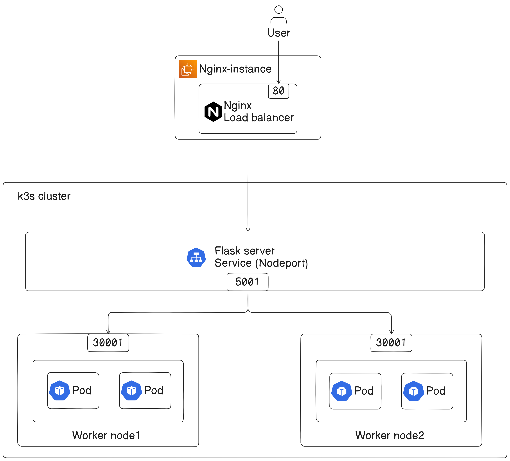

# Installation of K3s and Nginx Layer 4 Load Balancing in AWS

## Overview

In this lab, we will set up a lightweight Kubernetes environment using `K3s` on an AWS EC2 instance. Following the installation, we will configure Nginx as a `Layer 4 load balancer` to manage traffic to worker nodes. The services will be exposed using Kubernetes NodePort, allowing external access through Nginx.



Basically, these are the task we will perform in this lab:

1. Create AWS infrastructure using PULUMI
2. Create a simple flask server, build image, push to docker hub
3. Install and configure k3s and worker nodes
4. Deploy the servers in k3s cluster.
5. Install Nginx on the load balancer EC2 instance
6. Configure Nginx to load balance traffic to the worker node EC2 instances
7. Test the load balancer to ensure it is working correctly


## Step by step guide

## Step 1: Create AWS infrastructure using PULUMI

For this project, we need an instance for NGINX, and three instance for k3s (master-instance, worker1-instance, worker2-instance) and other necessary resouces.

### Step 1.1: Configure AWS CLI

- Configure AWS CLI with the necessary credentials. Run the following command and follow the prompts to configure it:

    ```sh
    aws configure
    ```

- **Explanation**: This command sets up your AWS CLI with the necessary credentials, region, and output format.


You will find the `AWS Access key` and `AWS Seceret Access key` on Lab description page,where you generated the credentials


### Step 1.2: Set Up a Pulumi Project

1. **Set Up a Pulumi Project**:
   - Create a new directory for your project and navigate into it:
     ```sh
     mkdir aws-k3s-infra
     cd aws-k3s-infra
     ```

2. **Initialize a New Pulumi Project**:
   - Run the following command to create a new Pulumi project:
     ```sh
     pulumi new aws-javascript
     ```
   - Follow the prompts to set up your project.

3. **Create a Key Pair**:
   - Run the following command to create a new key pair:
     ```sh
     aws ec2 create-key-pair --key-name MyKeyPair --query 'KeyMaterial' --output text > MyKeyPair.pem
     ```

4. **Set File Permissions**:

   - **For Linux**:
     ```sh
     chmod 400 MyKeyPair.pem
     ```

     

### Step 1.3: Create the Pulumi Program

1. **Open `index.js`**:
   - Open the `index.js` file in your project directory.

    ```js
    const pulumi = require("@pulumi/pulumi");
    const aws = require("@pulumi/aws");

    // Create a VPC
    const vpc = new aws.ec2.Vpc("my-vpc", {
        cidrBlock: "10.0.0.0/16",
        tags: {
            Name: "my-vpc"
        }
    });

    exports.vpcId = vpc.id;

    // Create a public subnet
    const publicSubnet = new aws.ec2.Subnet("public-subnet", {
        vpcId: vpc.id,
        cidrBlock: "10.0.1.0/24",
        availabilityZone: "ap-southeast-1a",
        mapPublicIpOnLaunch: true,
        tags: {
            Name: "public-subnet"
        }
    });

    exports.publicSubnetId = publicSubnet.id;

    // Create an Internet Gateway
    const igw = new aws.ec2.InternetGateway("internet-gateway", {
        vpcId: vpc.id,
        tags: {
            Name: "igw"
        }
    });

    exports.igwId = igw.id;

    // Create a route table
    const publicRouteTable = new aws.ec2.RouteTable("public-route-table", {
        vpcId: vpc.id,
        tags: {
            Name: "rt-public"
        }
    });

    // Create a route in the route table for the Internet Gateway
    const route = new aws.ec2.Route("igw-route", {
        routeTableId: publicRouteTable.id,
        destinationCidrBlock: "0.0.0.0/0",
        gatewayId: igw.id
    });

    // Associate the route table with the public subnet
    const routeTableAssociation = new aws.ec2.RouteTableAssociation("public-route-table-association", {
        subnetId: publicSubnet.id,
        routeTableId: publicRouteTable.id
    });

    exports.publicRouteTableId = publicRouteTable.id;


    // Create a security group for the public instance
    const publicSecurityGroup = new aws.ec2.SecurityGroup("public-secgrp", {
        vpcId: vpc.id,
        description: "Enable HTTP and SSH access for public instance",
        ingress: [
            { protocol: "tcp", fromPort: 80, toPort: 80, cidrBlocks: ["0.0.0.0/0"] },
            { protocol: "tcp", fromPort: 22, toPort: 22, cidrBlocks: ["0.0.0.0/0"] }
        ],
        egress: [
            { protocol: "-1", fromPort: 0, toPort: 0, cidrBlocks: ["0.0.0.0/0"] }
        ]
    });

    // Use the specified Ubuntu 24.04 LTS AMI
    const amiId = "ami-060e277c0d4cce553";

    // Create nginx instance
    const nginxInstance = new aws.ec2.Instance("nginx-instance", {
        instanceType: "t2.micro",
        vpcSecurityGroupIds: [publicSecurityGroup.id],
        ami: amiId,
        subnetId: publicSubnet.id,
        keyName: "MyKeyPair",
        associatePublicIpAddress: true,
        tags: {
            Name: "nginx-lb"
        }
    });

    exports.publicInstanceId = nginxInstance.id;
    exports.publicInstanceIp = nginxInstance.publicIp;

    // Create master instance
    const masterInstance = new aws.ec2.Instance("master-instance", {
        instanceType: "t3.small",
        vpcSecurityGroupIds: [publicSecurityGroup.id],
        ami: amiId,
        subnetId: publicSubnet.id,
        keyName: "MyKeyPair",
        associatePublicIpAddress: true,
        tags: {
            Name: "master"
        }
    });

    exports.publicInstanceId = masterInstance.id;
    exports.publicInstanceIp = masterInstance.publicIp;

    // Create worker1 instance
    const worker1Instance = new aws.ec2.Instance("worker1-instance", {
        instanceType: "t3.small",
        vpcSecurityGroupIds: [publicSecurityGroup.id],
        ami: amiId,
        subnetId: publicSubnet.id,
        keyName: "MyKeyPair",
        associatePublicIpAddress: true,
        tags: {
            Name: "worker1"
        }
    });

    exports.publicInstanceId = worker1Instance.id;
    exports.publicInstanceIp = worker1Instance.publicIp;

    // create worker2 instance
    const worker2Instance = new aws.ec2.Instance("worker2-instance", {
        instanceType: "t3.small",
        vpcSecurityGroupIds: [publicSecurityGroup.id],
        ami: amiId,
        subnetId: publicSubnet.id,
        keyName: "MyKeyPair",
        associatePublicIpAddress: true,
        tags: {
            Name: "worker2"
        }
    });

    exports.publicInstanceId = worker2Instance.id;
    exports.publicInstanceIp = worker2Instance.publicIp;
    ```

**NOTE:** Update the security group inbound rules accordingly to your requirement.

### Step 1.4: Deploy the Pulumi Stack

1. **Run Pulumi Up**:
   - Deploy the stack using:
     ```sh
     pulumi up
     ```
   - Review the changes and confirm by typing "yes".

### Step 1.5: Verify the Deployment

**Check the Outputs**:

- After the deployment completes, you should see the exported VPC ID, public subnet ID, private subnet ID, NAT Gateway ID, and instance IDs in the output.


## Step 2: Create a simple flask server, build image, push to docker hub

- Create a directory (e.g., flask-server-1)

    ```sh
    mkdir flask-server-1
    cd flask-server-1
    ```
- Create a file `app.py`

    ```sh
    from flask import Flask, jsonify

    app = Flask(__name__)

    @app.route('/')
    def home():
        return "Hello, from Flask server 1!"

    @app.route('/api/data')
    def get_data():
        data = {"message": "Hello, World!", "status": "success"}
        return jsonify(data)

    if __name__ == '__main__':
        app.run(host='0.0.0.0', port=5001)
    ```

- Create a file `Dockerfile`

    ```sh
    # Use an official Python runtime as a parent image
    FROM python:3.9-slim

    # Set the working directory in the container
    WORKDIR /app

    # Copy the current directory contents into the container at /app
    COPY . /app

    # Install any needed packages
    RUN pip install --no-cache-dir Flask

    # Make port 5001 available to the world outside this container
    EXPOSE 5001

    # Define environment variable
    ENV FLASK_APP=app.py

    # Run app.py when the container launches
    CMD ["flask", "run", "--host=0.0.0.0", "--port=5001"]
    ```

- Build and push the image to docker hub

    ```sh
    docker build -t flask-server-1 .
    docker tag flask-server-1:latest <your-docker-hub-username>/flask-server
    docker push <your-docker-hub-username>/flask-server
    ```


## Step 3: Install and configure k3s and worker nodes

### Step 3.1: Install k3s on Master Node:

- Run the following command on the master node to install k3s:
  ```bash
  curl -sfL https://get.k3s.io | sh -
  ```
- After installation, the master node should become the control plane for your Kubernetes cluster.


### Step 3.2: Join Worker Nodes to the Cluster:

- Retrieve the token from the master node to join worker nodes:
  ```bash
  sudo cat /var/lib/rancher/k3s/server/node-token
  ```
- Copy the token.

- SSH into `each worker node` and run the following command to join it to the cluster (replace `<master-ip>` with the private IP of the master node and `<token>` with the token obtained earlier):

  ```bash
  curl -sfL https://get.k3s.io | K3S_URL=https://<master-ip>:6443 K3S_TOKEN=<token> sh -
  ```

### Step 3.3: Verify Cluster Setup:

- SSH into the master node and set the permission.

    ```sh
    sudo chmod 644 /etc/rancher/k3s/k3s.yaml
    ```
- Run this command to verify all nodes

  ```bash
  kubectl get nodes
  ```
- You should see the master node and both worker nodes listed as ready.

    


## Step 4: Deploy the servers in k3s cluster.

### Step 4.1: Create the manifest files

- SSH into Master instance and Create a directory (e.g., *manifest*)
    ```sh
    mkdir manifest
    cd manifest
    ```
- Create manifest file for server1 deployment

```sh
apiVersion: apps/v1
kind: Deployment
metadata:
  name: server1-deployment
spec:
  replicas: 2
  selector:
    matchLabels:
      app: server1
  template:
    metadata:
      labels:
        app: server1
    spec:
      containers:
      - name: server1
        image: konami98/flask-server-1:v2
        ports:
        - containerPort: 5001
      nodeSelector:
        role: worker-node
---
apiVersion: v1
kind: Service
metadata:
  name: server1-service
spec:
  selector:
    app: server1
  ports:
    - protocol: TCP
      port: 5001
      targetPort: 5001
      nodePort: 30001
  type: NodePort

```

### Step 4.2: Label Your Worker Nodes
We need to label both worker nodes as we want to deploy the flask server in both the worker nodes.

- Label worker-node-1:

    ```bash
    kubectl label nodes <worker-node-1> role=worker-node
    ```
- Label worker-node-2:

    ```bash
    kubectl label nodes <worker-node-2> role=worker-node
    ```

**NOTE:** Make sure to replace with your worker node name


### Step 4.2: Create the resources

- Apply the manifests file

    ```sh
    kubectl apply -f server-1-deploy.yml
    ```

- Check the created resources

    ```sh
    kubectl get all
    ```

You can see the created pods, deployemt and service. Make sure all are in the running state.

## Step 5: Set up Nginx in the Nginx instance

Now, connect to the `Nginx instance` and create a `nginx.conf` file and a `Dockerfile`. 

### Step 5.1: Install Docker.

- Create a file named `install.sh` and insert the following code:

    ```bash
    #!/bin/bash

    # Update package database and upgrade existing packages
    sudo apt update && sudo apt upgrade -y

    # Install required packages
    sudo apt install -y apt-transport-https ca-certificates curl software-properties-common

    # Add Docker’s official GPG key
    curl -fsSL https://download.docker.com/linux/ubuntu/gpg | sudo gpg --dearmor -o /usr/share/keyrings/docker-archive-keyring.gpg

    # Add Docker APT repository
    echo "deb [arch=amd64 signed-by=/usr/share/keyrings/docker-archive-keyring.gpg] https://download.docker.com/linux/ubuntu $(lsb_release -cs) stable" | sudo tee /etc/apt/sources.list.d/docker.list > /dev/null

    # Install Docker
    sudo apt update && sudo apt install -y docker-ce

    # Add current user to Docker group and set Docker socket permissions
    sudo usermod -aG docker ${USER} && sudo chmod 666 /var/run/docker.sock

    # Verify Docker installation
    docker --version
    ```

- Make your script executable and run the srcipt

    ```bash
    chmod +x install.sh
    ./install.sh
    ```
- Verify Docker installation by running the following command:

    ```bash
    docker ps
    ```

### Step 5.2: Configure Nginx

- Create a directory (e.g., `Nginx`)

    ```bash
    mkdir Nginx
    cd Nginx
    ```

- Create nginx.conf in the Nginx directory with the following configuration:

    ```sh
    events {}

    stream {
        upstream flask_app {
            server <worker1-instance-ip>:30001;
            server <worker2-instance-ip>:30001;
        }

        server {
            listen 80;
            proxy_pass flask_app;
            proxy_connect_timeout 1s;
            proxy_timeout 3s;
        }
    }
    ```

- Create a Dockerfile

    ```Dockerfile
    FROM nginx:latest
    COPY nginx.conf /etc/nginx/nginx.conf
    ```

- Build Nginx Docker Image

    ```bash
    docker build -t custom-nginx .
    ```
    This command builds a Docker image for Nginx with our custom configuration.
- Run the Nginx Docker image

    ```bash
    docker run -d -p 80:80 --name my_nginx custom-nginx
    ```

    This command starts the Nginx container with our custom configuration.

## Step 6: Telnet the instances

- Telnet from local machine to nginx server

    ```sh
    telnet <nginx-instance-ip> 80
    ```
    

- Telnet from Load-balancer instance(nginx) to k3s cluster worker nodeport

    ```sh
    telnet <worker-node-ip> 30001
    ```

    

## Step 7: Verification

- Run this command to check if server is deployed in both worker node

    ```sh
    kubectl get pods -o wide
    ```
    

    Here, we can see our server is deployed in both the worker node.


- Visit http://<nginx-public-ip> in a web browser. You should see a response from one of the Flask applications deployed in k3s cluster.


---

So, we have completed our task successfully. We have installed and configure k3s and deployed the server in the k3s cluster. Then configured a layer4 loadbalancer using nginx.

