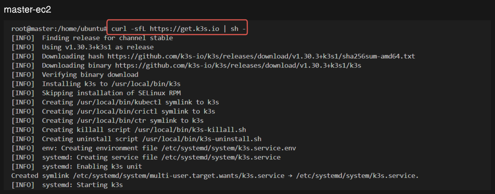
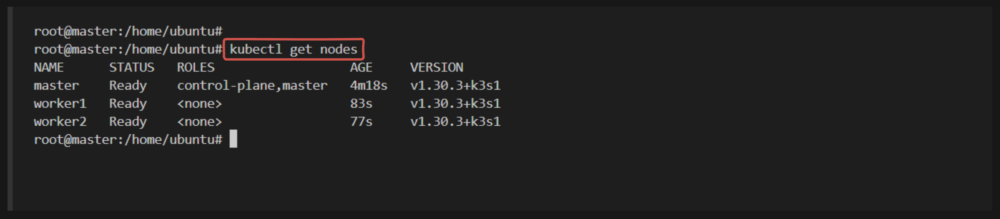
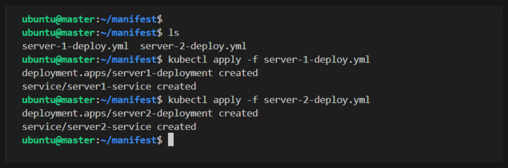
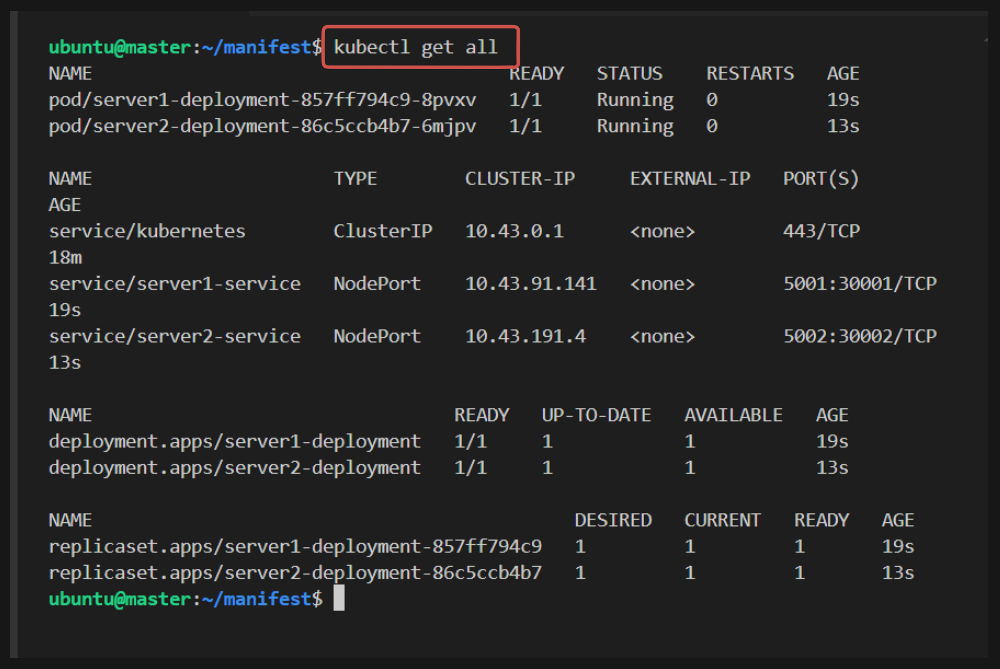
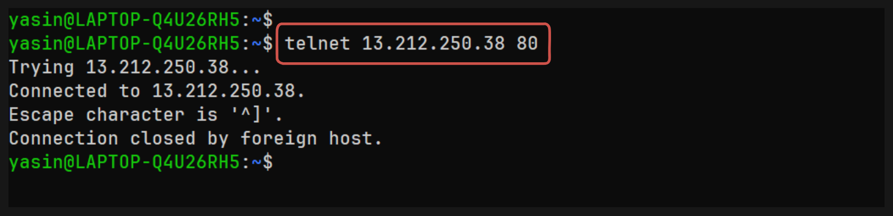
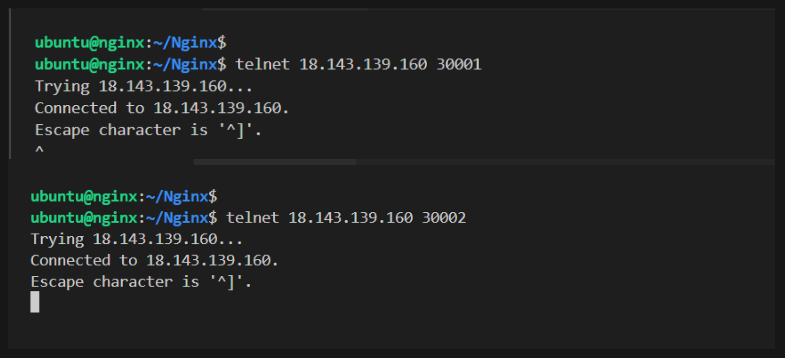

# Installation of K3s and Nginx Layer 4 Load Balancing with NodePort Service Exposure in AWS EC2

## Overview

In this scenario, you are tasked with setting up a lightweight Kubernetes environment using K3s on an AWS EC2 instance. Following the installation, you will configure Nginx as a Layer 4 load balancer to manage traffic to your Kubernetes services. The services will be exposed using Kubernetes NodePort, allowing external access through Nginx.

1. Create AWS infrastructure using PULUMI
2. Install and configure k3s and worker nodes
3. Deploy the servers in k3s cluster.
4. Install Nginx on the load balancer EC2 instance
5. Configure Nginx to load balance traffic to the worker node EC2 instances
6. Test the load balancer to ensure it is working correctly

## Step by step guide

## Step 1: Create AWS infrastructure using PULUMI

For this project, we need an instance for NGINX, and three instance for k3s (master-ec2,)

### Step 1.1: Configure AWS CLI

### Install AWS CLI

Before proceeding, ensure that the AWS CLI is installed on your local machine. Follow the instructions below based on your operating system:

#### Configure AWS CLI

After installing the AWS CLI, configure it with the necessary credentials. Run the following command and follow the prompts to configure it:

```sh
aws configure
```

- **Explanation**: This command sets up your AWS CLI with the necessary credentials, region, and output format.


You will find the `AWS Access key` and `AWS Seceret Access key` on Lab description page,where you generated the credentials


### Step 1.2: Set Up a Pulumi Project

1. **Set Up a Pulumi Project**:
   - Create a new directory for your project and navigate into it:
     ```sh
     mkdir aws-k3s-infra
     cd aws-k3s-infra
     ```

2. **Initialize a New Pulumi Project**:
   - Run the following command to create a new Pulumi project:
     ```sh
     pulumi new aws-javascript
     ```
   - Follow the prompts to set up your project.

3. **Create a Key Pair**:
   - Run the following command to create a new key pair:
     ```sh
     aws ec2 create-key-pair --key-name MyKeyPair --query 'KeyMaterial' --output text > MyKeyPair.pem
     ```

4. **Set File Permissions**:

   - **For Linux**:
     ```sh
     chmod 400 MyKeyPair.pem
     ```

     

### Step 1.3: Create the Pulumi Program

1. **Open `index.js`**:
   - Open the `index.js` file in your project directory.

2. **Create the VPC**:
   - A Virtual Private Cloud (VPC) is a virtual network dedicated to your AWS account. You can configure your VPC with a range of IP addresses, subnets, route tables, and network gateways.
   ```javascript
   const pulumi = require("@pulumi/pulumi");
   const aws = require("@pulumi/aws");

   // Create a VPC
   const vpc = new aws.ec2.Vpc("my-vpc", {
       cidrBlock: "10.0.0.0/16",
       tags: {
        Name: "my-vpc"
       }
   });

   exports.vpcId = vpc.id;
   ```

3. **Create the Public Subnet**:
   - A public subnet is one that has a route to an Internet Gateway, enabling instances within it to communicate with the Internet.
   ```javascript
   // Create a public subnet
   const publicSubnet = new aws.ec2.Subnet("public-subnet", {
       vpcId: vpc.id,
       cidrBlock: "10.0.1.0/24",
       availabilityZone: "us-east-1a",
       mapPublicIpOnLaunch: true,
       tags: {
        Name: "public-subnet"
       }
   });

   exports.publicSubnetId = publicSubnet.id;
   ```

4. **Create the Private Subnet**:
   - A private subnet does not have a route to an Internet Gateway, preventing instances within it from directly communicating with the Internet.
   ```javascript
   // Create a private subnet
   const privateSubnet = new aws.ec2.Subnet("private-subnet", {
       vpcId: vpc.id,
       cidrBlock: "10.0.2.0/24",
       availabilityZone: "us-east-1a",
       tags: {
        Name: "private-subnet"
       }
   });

   exports.privateSubnetId = privateSubnet.id;
   ```

5. **Create the Internet Gateway**:
   - An Internet Gateway (IGW) allows communication between instances in your VPC and the Internet.
   ```javascript
   // Create an Internet Gateway
   const igw = new aws.ec2.InternetGateway("internet-gateway", {
       vpcId: vpc.id,
       tags: {
        Name: "igw"
       }
   });

   exports.igwId = igw.id;
   ```

6. **Create the Public Route Table and Associate with Public Subnet**:
   - A route table contains a set of rules, called routes, that are used to determine where network traffic is directed. Here, you will create a route table, add a route to the IGW, and associate it with the public subnet.
   ```javascript
   // Create a route table
   const publicRouteTable = new aws.ec2.RouteTable("public-route-table", {
       vpcId: vpc.id,
       tags: {
        Name: "rt-public"
       }
   });

   // Create a route in the route table for the Internet Gateway
   const route = new aws.ec2.Route("igw-route", {
       routeTableId: publicRouteTable.id,
       destinationCidrBlock: "0.0.0.0/0",
       gatewayId: igw.id
   });

   // Associate the route table with the public subnet
   const routeTableAssociation = new aws.ec2.RouteTableAssociation("public-route-table-association", {
       subnetId: publicSubnet.id,
       routeTableId: publicRouteTable.id
   });

   exports.publicRouteTableId = publicRouteTable.id;
   ```

7. **Create the NAT Gateway**:
   - A NAT Gateway allows instances in a private subnet to connect to the Internet or other AWS services, but prevents the Internet from initiating connections with the instances. This is necessary for updating instances in the private subnet.
   ```javascript
   // Allocate an Elastic IP for the NAT Gateway
   const eip = new aws.ec2.Eip("nat-eip", { vpc: true });

   // Create the NAT Gateway
   const natGateway = new aws.ec2.NatGateway("nat-gateway", {
       subnetId: publicSubnet.id,
       allocationId: eip.id,
       tags: {
        Name: "nat"
       }
   });

   exports.natGatewayId = natGateway.id;
   ```

8. **Create the Private Route Table and Associate with Private Subnet**:
   - The private route table directs traffic from the private subnet to the NAT Gateway for outbound Internet access.
   ```javascript
   // Create a route table for the private subnet
   const privateRouteTable = new aws.ec2.RouteTable("private-route-table", {
       vpcId: vpc.id,
       tags: {
        Name: "rt-private"
       }
   });

   // Create a route in the route table for the NAT Gateway
   const privateRoute = new aws.ec2.Route("nat-route", {
       routeTableId: privateRouteTable.id,
       destinationCidrBlock: "0.0.0.0/0",
       natGatewayId: natGateway.id
   });

   // Associate the route table with the private subnet
   const privateRouteTableAssociation = new aws.ec2.RouteTableAssociation("private-route-table-association", {
       subnetId: privateSubnet.id,
       routeTableId: privateRouteTable.id
   });

   exports.privateRouteTableId = privateRouteTable.id;
   ```

9. **Create Security Group**:
   - Create security Group with necessary rules. Here we have allowed all traffic for demonstration. But is not recommended for production. Change the rules according to your ports and addresses.

   ```javascript
   // Create a security group for the public instance
   const publicSecurityGroup = new aws.ec2.SecurityGroup("public-secgrp", {
       vpcId: vpc.id,
       description: "Enable HTTP and SSH access for public instance",
       ingress: [
            {
                protocol: "-1", // -1 means all protocols
                fromPort: 0,    // 0 means all ports
                toPort: 65535,  // 65535 is the highest port number
                cidrBlocks: ["0.0.0.0/0"], // Allow all IP addresses
            },
       ],
       egress: [
           { protocol: "-1", fromPort: 0, toPort: 0, cidrBlocks: ["0.0.0.0/0"] }
       ]
   });
   ```
   Explanation:
    - protocol: "-1": This allows all protocols (TCP, UDP, ICMP, etc.).
    - fromPort: 0 and toPort: 65535: This allows all ports from the lowest to the highest (0-65535).
    - cidrBlocks: ["0.0.0.0/0"]: This allows traffic from any IP address.

9. **Create EC2 instances**:
- Create nginx ec2 instance
    ```js
    // Use the specified Ubuntu 24.04 LTS AMI
    const amiId = "ami-060e277c0d4cce553";

    const nginxInstance = new aws.ec2.Instance("nginx-instance", {
        instanceType: "t2.micro",
        vpcSecurityGroupIds: [publicSecurityGroup.id],
        ami: amiId,
        subnetId: publicSubnet.id,
        keyName: "MyKeyPair",
        associatePublicIpAddress: true,
        tags: {
            Name: "nginx-lb"
        }
    });

    exports.publicInstanceId = nginxInstance.id;
    exports.publicInstanceIp = nginxInstance.publicIp;
   ```

- Create master ec2 instance

    ```js
    const masterInstance = new aws.ec2.Instance("master-instance", {
        instanceType: "t3.small",
        vpcSecurityGroupIds: [publicSecurityGroup.id],
        ami: amiId,
        subnetId: publicSubnet.id,
        keyName: "MyKeyPair",
        associatePublicIpAddress: true,
        tags: {
            Name: "master"
        }
    });

    exports.publicInstanceId = masterInstance.id;
    exports.publicInstanceIp = masterInstance.publicIp;
    ```

- Create worker ec2 instances

    ```js
    const worker1Instance = new aws.ec2.Instance("worker1-instance", {
        instanceType: "t3.small",
        vpcSecurityGroupIds: [publicSecurityGroup.id],
        ami: amiId,
        subnetId: publicSubnet.id,
        keyName: "MyKeyPair",
        associatePublicIpAddress: true,
        tags: {
            Name: "worker1"
        }
    });

    exports.publicInstanceId = worker1Instance.id;
    exports.publicInstanceIp = worker1Instance.publicIp;


    const worker2Instance = new aws.ec2.Instance("worker2-instance", {
        instanceType: "t3.small",
        vpcSecurityGroupIds: [publicSecurityGroup.id],
        ami: amiId,
        subnetId: publicSubnet.id,
        keyName: "MyKeyPair",
        associatePublicIpAddress: true,
        tags: {
            Name: "worker2"
        }
    });

    exports.publicInstanceId = worker2Instance.id;
    exports.publicInstanceIp = worker2Instance.publicIp;
    ```

### Step 1.4: Deploy the Pulumi Stack

1. **Run Pulumi Up**:
   - Deploy the stack using:
     ```sh
     pulumi up
     ```
   - Review the changes and confirm by typing "yes".

### Step 1.5: Verify the Deployment

**Check the Outputs**:

- After the deployment completes, you should see the exported VPC ID, public subnet ID, private subnet ID, NAT Gateway ID, and instance IDs in the output.


## Step 2: Install and configure k3s and worker nodes

### Step 2.1: Install k3s on Master Node:

- Run the following command on the master node to install k3s:
  ```bash
  curl -sfL https://get.k3s.io | sh -
  ```
- After installation, the master node should become the control plane for your Kubernetes cluster.



### Step 2.2: Join Worker Nodes to the Cluster:

- Retrieve the token from the master node to join worker nodes:
  ```bash
  sudo cat /var/lib/rancher/k3s/server/node-token
  ```
- Copy the token.

- SSH into `each worker node` and run the following command to join it to the cluster (replace `<master-ip>` with the private IP of the master node and `<token>` with the token obtained earlier):
  ```bash
  curl -sfL https://get.k3s.io | K3S_URL=https://<master-ip>:6443 K3S_TOKEN=<token> sh -
  ```

### Step 2.3: Verify Cluster Setup:

- SSH into the master node and verify that all nodes are part of the cluster:
  ```bash
  kubectl get nodes
  ```
- You should see the master node and both worker nodes listed as ready.

    


## Step 3: Deploy the servers in k3s cluster.

### Step 3.1: Create the manifest files

- Create a directory (e.g., *manifest*)
```sh
mkdir manifest
cd manifest
```
- Create a manifest file for server1 deployment

```sh
apiVersion: apps/v1
kind: Deployment
metadata:
  name: server1-deployment
spec:
  replicas: 1
  selector:
    matchLabels:
      app: server1
  template:
    metadata:
      labels:
        app: server1
    spec:
      containers:
      - name: server1
        image: konami98/flask-server-1:v2
        ports:
        - containerPort: 5001

---
apiVersion: v1
kind: Service
metadata:
  name: server1-service
spec:
  selector:
    app: server1
  ports:
    - protocol: TCP
      port: 5001
      targetPort: 5001
      nodePort: 30001
  type: NodePort
```

- Create a manifest file for server2 deployment

```sh
apiVersion: apps/v1
kind: Deployment
metadata:
  name: server2-deployment
spec:
  replicas: 1
  selector:
    matchLabels:
      app: server2
  template:
    metadata:
      labels:
        app: server2
    spec:
      containers:
      - name: server2
        image: konami98/flask-server-2:v2
        ports:
        - containerPort: 5002

---

apiVersion: v1
kind: Service
metadata:
  name: server2-service
spec:
  selector:
    app: server2
  ports:
    - protocol: TCP
      port: 5002
      targetPort: 5002
      nodePort: 30002
  type: NodePort
```

### Step 3.2: Create the resources

- Apply the manifests file

    ```sh
    kubectl apply -f server-1-deploy.yml
    kubectl apply -f server-2-deploy.yml
    ```

    

- Check the created resources

    ```sh
    kubectl get all
    ```

    

## Step 4: Set up Nginx

Now, connect to the `nginx instance` and create a `nginx.conf` file and a `Dockerfile`. 

### Step 4.1: Install Docker

- Create a file named `install.sh` and insert the following code:

    ```bash
    #!/bin/bash

    # Update package database and upgrade existing packages
    sudo apt update && sudo apt upgrade -y

    # Install required packages
    sudo apt install -y apt-transport-https ca-certificates curl software-properties-common

    # Add Docker’s official GPG key
    curl -fsSL https://download.docker.com/linux/ubuntu/gpg | sudo gpg --dearmor -o /usr/share/keyrings/docker-archive-keyring.gpg

    # Add Docker APT repository
    echo "deb [arch=amd64 signed-by=/usr/share/keyrings/docker-archive-keyring.gpg] https://download.docker.com/linux/ubuntu $(lsb_release -cs) stable" | sudo tee /etc/apt/sources.list.d/docker.list > /dev/null

    # Install Docker
    sudo apt update && sudo apt install -y docker-ce

    # Add current user to Docker group and set Docker socket permissions
    sudo usermod -aG docker ${USER} && sudo chmod 666 /var/run/docker.sock

    # Verify Docker installation
    docker --version
    ```

- Make your script executable:

    ```bash
    chmod +x install.sh
    ```

- Execute the script to install Docker:

    ```bash
    ./install.sh
    ```

### Step 4.2: Configure Nginx

- Create a directory (e.g., `Nginx`)

```bash
mkdir Nginx
cd Nginx
```

- Create nginx.conf in the Nginx directory with the following configuration:

    ```sh
    events {}

    stream {
        upstream flask_app {
            server <master-instance-ip>:30001;
            server <master-instance-ip>:30002;
        }

        server {
            listen 80;
            proxy_pass flask_app;
            proxy_connect_timeout 1s;
            proxy_timeout 3s;
        }
    }
    ```

- Create a Dockerfile

    ```Dockerfile
    FROM nginx:latest
    COPY nginx.conf /etc/nginx/nginx.conf
    ```

- Build Nginx Docker Image

    ```bash
    docker build -t custom-nginx .
    ```
    This command builds a Docker image for Nginx with our custom configuration.
- Run the Nginx Docker image

    ```bash
    docker run -d -p 80:80 --name my_nginx custom-nginx
    ```

    This command starts the Nginx container with our custom configuration.

## Step 05: Telnet the instances

- Telnet from local machine to nginx server

    ```sh
    telnet <nginx-instance-ip> 80
    ```
    

- Telnet from Load-balancer instance(nginx) to k3s cluster nodeport

    ```sh
    telnet <master-instance-ip> 30001
    telnet <master-instance-ip> 30002
    ```

    

## Step 06: Verification
